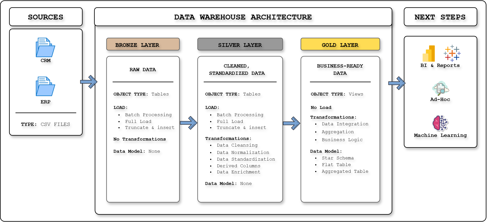
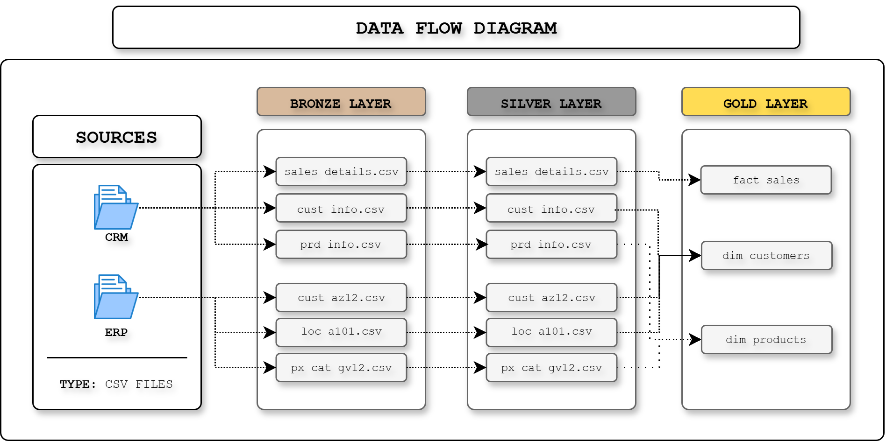
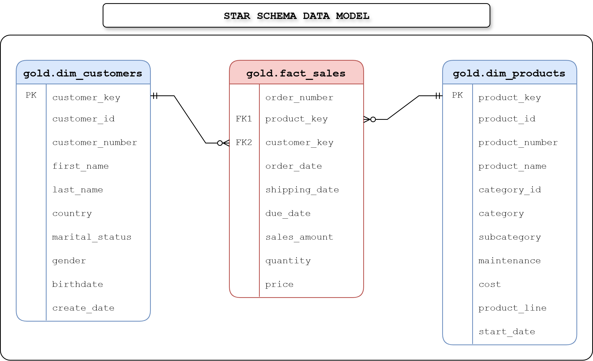
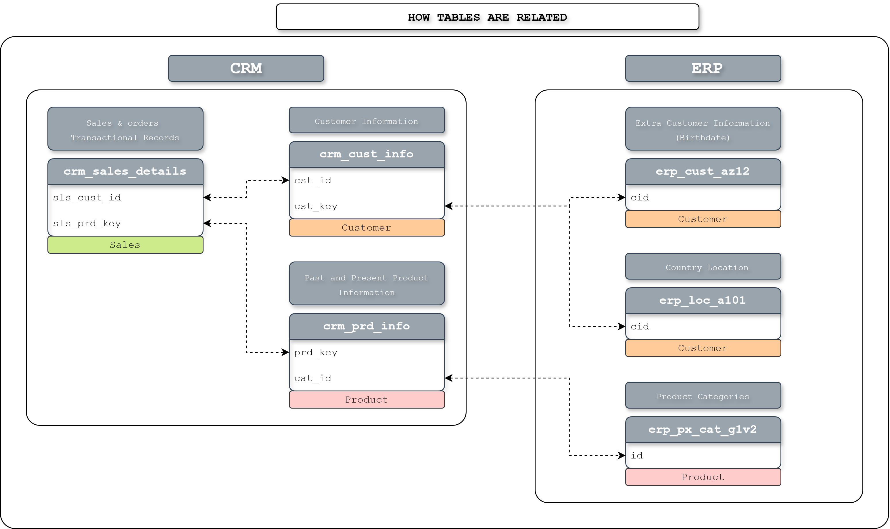

# SQL Data Warehouse Project

> A production-grade relational data warehouse built with standard SQL, designed for scalability, maintainability, and analytical performance.

---

## Table of Contents

- [📌 Project Overview](#project-overview)
- [🏗️ Architecture](#architecture)
- [🧩 Data Model](#data-model)
- [📁 Repository Structure](#repository-structure)
- [🚀 Getting Started](#getting-started)
- [✅ Data Quality](#data-quality)
- [📚 Documentation](#documentation)
- [🛠️ Engineering Notes](#engineering-notes)

---

## 📌 Project Overview

This warehouse consolidates and harmonizes operational data from two independent source systems, CRM and ERP, into a clean, queryable star schema optimized for reporting and analytics.

The pipeline follows the Medallion Architecture, separating raw ingestion, cleansing, and business modeling into distinct layers so each step stays traceable and easy to maintain.

### 📦 Source Systems

| System | Domain | Raw Files |
|---|---|---|
| CRM | Customer profiles, product catalog, sales transactions | [cust_info.csv](datasets/source_crm/cust_info.csv)<br>[prd_info.csv](datasets/source_crm/prd_info.csv)<br>[sales_details.csv](datasets/source_crm/sales_details.csv) |
| ERP | Customer demographics, geographic mapping, product categories | [CUST_AZ12.csv](datasets/source_erp/CUST_AZ12.csv)<br>[LOC_A101.csv](datasets/source_erp/LOC_A101.csv)<br>[PX_CAT_G1V2.csv](datasets/source_erp/PX_CAT_G1V2.csv) |

---

## 🏗️ Architecture

The architecture uses three warehouse layers, each backed by its own SQL scripts and responsibilities.



### 🧱 Layer Breakdown

| Layer | Schema | Purpose | Key Scripts |
|---|---|---|---|
| Bronze | `bronze` | Raw ingestion with 1:1 source mapping | [ddl_bronze_layer.sql](scripts/01_bronze_layer/ddl_bronze_layer.sql)<br>[procedure_load_bronze_layer.sql](scripts/01_bronze_layer/procedure_load_bronze_layer.sql) |
| Silver | `silver` | Cleansing, type casting, deduplication, and standardization | [ddl_silver_layer.sql](scripts/02_silver_layer/ddl_silver_layer.sql)<br>[procedure_load_silver_layer.sql](scripts/02_silver_layer/procedure_load_silver_layer.sql) |
| Gold | `gold` | Dimensional model for analytical consumption | [ddl_gold_layer.sql](scripts/03_gold_layer/ddl_gold_layer.sql) |

### 🖼️ Architecture Diagram

The diagram below shows the full flow across the Medallion layers:



---

## 🧩 Data Model

The Gold layer exposes a Kimball-style star schema with a single fact table and conformed dimensions.



### 📋 Gold Layer Tables

| Table | Role | Description |
|---|---|---|
| `gold.dim_customers` | Dimension | Unified customer profile joined from CRM and ERP, including geography and demographic attributes |
| `gold.dim_products` | Dimension | Product reference table enriched with category and subcategory hierarchies |
| `gold.fact_sales` | Fact | Line-item sales transactions linked to dimensions via surrogate keys |

### 🔗 Relationship View



---

## 📁 Repository Structure

```text
.
├── datasets/
│   ├── source_crm/
│   │   ├── cust_info.csv
│   │   ├── prd_info.csv
│   │   └── sales_details.csv
│   └── source_erp/
│       ├── CUST_AZ12.csv
│       ├── LOC_A101.csv
│       └── PX_CAT_G1V2.csv
├── scripts/
│   ├── initialize_database.sql
│   ├── 01_bronze_layer/
│   │   ├── ddl_bronze_layer.sql
│   │   └── procedure_load_bronze_layer.sql
│   ├── 02_silver_layer/
│   │   ├── ddl_silver_layer.sql
│   │   └── procedure_load_silver_layer.sql
│   └── 03_gold_layer/
│       └── ddl_gold_layer.sql
├── tests/
│   ├── silver_layer_quality_checker.sql
│   └── gold_layer_quality_checker.sql
└── docs/
	├── naming_conventions.md
	├── data_catalog.md
	├── data_architecture_diagram.png
	├── dataflow_diagram.png
	├── data_model.png
	└── table_relationships.png
```

---

## 🚀 Getting Started

1. Run [scripts/initialize_database.sql](scripts/initialize_database.sql) to create the database and schema structure.
2. Load the Bronze layer using [scripts/01_bronze_layer/ddl_bronze_layer.sql](scripts/01_bronze_layer/ddl_bronze_layer.sql) and [scripts/01_bronze_layer/procedure_load_bronze_layer.sql](scripts/01_bronze_layer/procedure_load_bronze_layer.sql).
3. Load the Silver layer using [scripts/02_silver_layer/ddl_silver_layer.sql](scripts/02_silver_layer/ddl_silver_layer.sql) and [scripts/02_silver_layer/procedure_load_silver_layer.sql](scripts/02_silver_layer/procedure_load_silver_layer.sql).
4. Build the Gold layer from [scripts/03_gold_layer/ddl_gold_layer.sql](scripts/03_gold_layer/ddl_gold_layer.sql).
5. Run the validation scripts in [tests/](tests/) before refreshing downstream reports.

---

## ✅ Data Quality

Quality checks are included for both the Silver and Gold layers to catch null values, duplicates, and referential integrity issues before data is consumed downstream.

| Script | Layer | Checks |
|---|---|---|
| [silver_layer_quality_checker.sql](tests/silver_layer_quality_checker.sql) | Silver | Null handling, duplicate detection, data type consistency, cleansing outcomes |
| [gold_layer_quality_checker.sql](tests/gold_layer_quality_checker.sql) | Gold | Referential integrity, surrogate key uniqueness, dimensional model validation |

---

## 📚 Documentation

| Document | Purpose |
|---|---|
| [docs/naming_conventions.md](docs/naming_conventions.md) | Naming standards for schemas, tables, columns, stored procedures, and views |
| [docs/data_catalog.md](docs/data_catalog.md) | Field-level descriptions, data types, and business definitions for the Gold layer |

### 📖 Recommended Reading Order

1. Review [docs/naming_conventions.md](docs/naming_conventions.md) to understand the object naming standards.
2. Review [docs/data_catalog.md](docs/data_catalog.md) for the Gold layer column definitions.
3. Inspect [docs/data_architecture_diagram.png](docs/data_architecture_diagram.png) and [docs/data_model.png](docs/data_model.png) for the warehouse structure.
4. Walk through [scripts/initialize_database.sql](scripts/initialize_database.sql) and the layer scripts in [scripts/](scripts/) to understand the load flow.

---

## 🛠️ Engineering Notes

### 🧠 SQL Patterns Used

| Pattern | Where Applied |
|---|---|
| `ROW_NUMBER()` | Deduplication logic in the Silver layer |
| `COALESCE` | Null-safe column fallbacks across CRM and ERP joins |
| `CASE` expressions | Standardizing categorical values such as gender and status codes |
| Surrogate keys | Dimensional stability in `dim_customers` and `dim_products` |

### 🧭 Design Decisions

- Stored procedures keep ETL logic repeatable and easy to rerun.
- Idempotent loads keep the pipeline predictable without requiring change-data-capture logic.
- Views in the Gold layer keep transformations declarative and avoid redundant storage.
- Surrogate keys decouple the warehouse from source key changes and improve join performance.

---

### 🙏 Acknowledgements
This project was inspired by and completed following the excellent comprehensive tutorial by **Data with Baraa**. 

* **YouTube Channel:** [Data with Baraa](https://www.youtube.com/@DatawithBaraa)
  
The architectural concepts, pipeline structure, and initial datasets used in this repository were guided by his teachings on enterprise data warehousing and the Medallion Architecture.